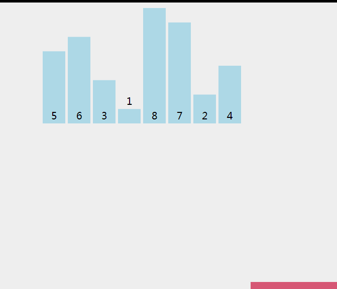

# 数组

[数组 · MDN](https://developer.mozilla.org/zh-CN/docs/Web/JavaScript/Reference/Global_Objects/Array)分为稀疏数组与密集数组。

[[toc]]

## Array.from()

`Array.from(arrayLike[, mapFn[, thisArg]])`

从一个类似数组或可迭代对象创建一个新的，浅拷贝的数组实例。

## Array.isArray()

用于确定传递的值是否是一个`Array`。

## 修改原数组

### Array.prototype.pop()

**删除最后一个**元素，并返回该元素。更改数组长度。

### Array.prototype.push()

将**一个或多个元素**添加到数组的**末尾**，并返回该数组的新长度。

### Array.prototype.shift()

方法从数组中**删除第一个**元素，并返回该元素。此方法更改数组的长度。

### Array.prototype.unshift()

将**一个或多个元素**添加到数组的**开头**，并返回该数组的新长度(该方法修改原有数组)。

### Array.prototype.reverse()

反转数组，并返回该数组。

### Array.prototype.sort()

对数组进行排序。

### Array.prototype.splice()

**删除或替换**现有元素或者原地添加新的元素来修改数组,并以数组形式返回被修改的内容。此方法会改变原数组。

## 创建新数组

### `Array.prototype.map()`

创建一个新数组，其结果是该数组中的每个元素都调用一个提供的函数后返回的结果。

### `Array.prototype.filter()`

过滤符合条件的数组元素，返回一个新数组。

### `Array.prototype.slice()`

返回一个新的数组，这一对象是一个由`begin`和`end`决定的原数组的浅拷贝（包括`begin`，不包括`end`）。

### `Array.prototype.concat()`

用于合并两个或多个数组。此方法不会更改现有数组，而是返回一个新数组。

### `Array.prototype.flat()`

方法会按照一个可指定的深度递归遍历数组，并将所有元素与遍历到的子数组中的元素合并为一个新数组返回。

## 查找数组

### `Array.prototype.find()`

返回数组中满足提供的测试函数的第一个元素的值。否则返回`undefined`。

### `Array.prototype.findIndex()`

返回数组中满足提供的测试函数的第一个元素的值的`index`。否则返回`-1`。

### `Array.prototype.indexOf()`

返回在数组中可以找到一个给定元素的第一个索引，如果不存在，则返回`-1`。

## 判断数组

### `Array.prototype.includes()`

用来判断一个数组是否包含一个指定的值，根据情况，如果包含则返回`true`，否则返回`false`

### `Array.prototype.some()`

测试数组中是不是有元素通过了被提供的函数测试

### `Array.prototype.every()`

测试一个数组内的所有元素是否都能通过某个指定函数的测试

## 其他

### `Array.prototype.forEach()`

对数组的每个元素执行一次提供的函数，`renturn undefined`。

### `Array.prototype.join()`

将一个数组（或一个类数组对象）的所有元素连接成一个字符串并返回这个字符串

### `Array.prototype.reduce()`

方法对数组中的每个元素执行一个由您提供的reducer函数(升序执行)，将其结果汇总为单个返回值。

# 问题

## 数组去重

### 1. Set

```js {2,6}
var arr = ['12', '32', '89', '12', '12', '78', '12', '32'];
arr = [...new Set(arr)];

function dedupe(array) {
    // Array.from()能把set结构转换为数组
    return Array.from(new Set(array));
}
```

### 2. 利用对象的key不能重复

```js
var arr = ['12', '32', '89', '12', '12', '78', '12', '32'];

function unique(a) {
    let obj = {};
    let array = [];

    arr.forEach(item => {
        if (!obj[item]) {
            obj[item] = item;
            array.push(item);
        }
    })
    return array;
}

arr = unique(arr);
```

### 3. 数组下标判断法

判断数组**当前项下标**与**第一次出现当前项数值的下标**是否是相同的。

```js {9,17}
var arr = ['12', '32', '89', '12', '12', '78', '12', '32'];

function unique(array) {
    // 结果数组
    var n = [array[0]];

    for (var i = 1; i < array.length; i++) {
        // 从第二项开始遍历
        if (array.indexOf(array[i]) == i)
            n.push(array[i]);
    }
    return n;
}

function unique2(array) {
    return array.filter((item, index, arr) => {
        return array.indexOf(item) === index
    })
}

arr = unique(arr);
```

### 4. indexOf

使用`indexOf`判断是否在**临时数组**中。

```js {6}
var arr = ['12', '32', '89', '12', '12', '78', '12', '32'];

function unique(array) {
    // 一个新的临时数组
    var n = [];
    array.forEach((item) => {
        if (n.indexOf(item) === -1) {
            n.push(item)
        }
    });
    return n
}

arr = unique(arr);
```

### 5. reduce + includes

```js
var arr = ['12', '32', '89', '12', '12', '78', '12', '32'];

function unique(a) {
    return a.reduce((prev, cur) => {
        return prev.includes(cur) ? prev : [...prev, cur]
    }, [])
}

arr = unique(arr)
```

### 6. splice

将当前项与**之后每一项**进行比较，如果相同就使用`splice()`删除。

```js {6}
var arr = ['12', '32', '89', '12', '12', '78', '12', '32'];

function unique(a) {
    for (let i = 0; i < a.length; i++) {
        for (let j = i + 1; j < a.length; j++) {
            if (a[i] == a[j]) {
                a.splice(j, 1);
                j--;
            }
        }
    }
}

unique(arr);
```

## 数组排序

::: tip

* [几个基本的前端排序方法 · 简书](https://www.jianshu.com/p/c6123b732dc3)
* [前端排序方法 · 博客园](https://www.cnblogs.com/lindazhong/p/6669013.html)
  :::

### 冒泡排序

实现思路： 用 for 循环遍历数组元素，拿出前一个和后一个元素对比，如果前边的值大于后边的值就交换位置，遍历元素进行排序。


```javascript
function bubbleSort(arr) {
    var len = arr.length;

    for (var i = 0; i < len - 1; i++) {
        for (var j = 0; j < len - 1 - i; j++) {
            if (arr[j] > arr[j + 1]) {        // 相邻元素两两对比
                var temp = arr[j + 1];        // 元素交换
                arr[j + 1] = arr[j];
                arr[j] = temp;
            }
        }
    }

    return arr;
}
```

### 快速排序

实现思路：

1. 在数据集之中，选择一个元素作为”基准”。
2. 所有小于”基准”的元素，都移到”基准”的左边；所有大于”基准”的元素，都移到”基准”的右边。这个操作称为分区操作，分区操作结束后，基准元素所处的位置就是最终排序后它的位置。
3. 对”基准”左边和右边的两个子集，不断重复第一步和第二步，直到所有子集只剩下一个元素为止。


```javascript
function quickSort(arr) {
    //如果数组<=1,则直接返回
    if (arr.length <= 1) {
        return arr;
    }
    var pivotIndex = Math.floor(arr.length / 2);
    //找基准，并把基准从原数组删除
    var pivot = arr.splice(pivotIndex, 1)[0];
    //定义左右数组
    var left = [];
    var right = [];

    //比基准小的放在left，比基准大的放在right
    for (var i = 0; i < arr.length; i++) {
        if (arr[i] <= pivot) {
            left.push(arr[i]);
        } else {
            right.push(arr[i]);
        }
    }
    //递归
    return quickSort(left).concat([pivot], quickSort(right));
}
```

### 选择排序

实现思路： 选择排序（Selection Sort）是一种简单直观的排序算法。它的工作原理如下：

首先在未排序序列中找到最小（大）元素，存放到排序序列的起始位置，然后，再从剩余未排序元素中继续寻找最小（大）元素，然后放到已排序序列的末尾。以此类推，直到所有元素均排序完毕。



```javascript
function selectionSort(arr) {
    var len = arr.length;
    var minIndex, temp;

    for (var i = 0; i < len - 1; i++) {
        minIndex = i;
        for (var j = i + 1; j < len; j++) {
            if (arr[j] < arr[minIndex]) {     // 寻找最小的数
                minIndex = j;                 // 将最小数的索引保存
            }
        }
        temp = arr[i];
        arr[i] = arr[minIndex];
        arr[minIndex] = temp;
    }

    return arr;
}
```

### 插入排序

### sort

## 数组清空

1. for 循环然后依次 pop || shift
2. 数组赋值 []
3. 数组的 length 是可操作的 所以设置 数组的 length = 0 也是变向的清空
4. `var a = [1,2,3] a.splice(0 , a.length )`splice 0 到它的长度就可以清空了;

## 数组扁平化

1. `Array.prototype.flat([depth])`

- depth - 指定要提取嵌套数组的结构深度，默认值为 1。

```js
var arr1 = [1, 2, [3, 4]];
arr1.flat();
// [1, 2, 3, 4]

var arr2 = [1, 2, [3, 4, [5, 6]]];
arr2.flat();
// [1, 2, 3, 4, [5, 6]]

var arr3 = [1, 2, [3, 4, [5, 6]]];
arr3.flat(2);
// [1, 2, 3, 4, 5, 6]
```

::: warning 注意 flat() 方法会移除数组中的空项
:::

```js
var arr4 = [1, 2, , 4, 5];
arr4.flat();
// [1, 2, 4, 5]
```

2. replace + split

```js
ary = str.replace(/(\[|\])/g, '').split(',')
```

3. replace + JSON.parse

```js
str = str.replace(/(\[|\]))/g, '');
str = '[' + str + ']';
ary = JSON.parse(str);
```

4. 递归

```js
let result = [];
let fn = function (ary) {
    for (let i = 0; i < ary.length; i++) {
        let item = ary[i];
        if (Array.isArray(ary[i])) {
            fn(item);
        } else {
            result.push(item);
        }
    }
}
```

5. reduce + contact

```js
function flatten(ary) {
    return ary.reduce((pre, cur) => {
        return pre.concat(Array.isArray(cur) ? flatten(cur) : cur);
    }, []);
}

let ary = [1, 2, [3, 4], [5, [6, 7]]]
console.log(flatten(ary))
```

6. 扩展运算符

```js
// 只要有一个元素有数组，那么循环继续
while (ary.some(Array.isArray)) {
    ary = [].concat(...ary);
}
```

## 判断数组中包含某个值

- `array.indexOf`、`array.findeIndex(callback[,thisArg])`
    - 存在，则返回数组元素的下标，否则返回-1。
- `array.includes(searchElement[, fromIndex])`
    - 存在返回true，否则返回false
- `array.find(callback[,thisArg])`
    - 返回数组中满足条件的第一个元素的值，如果没有，返回undefined

