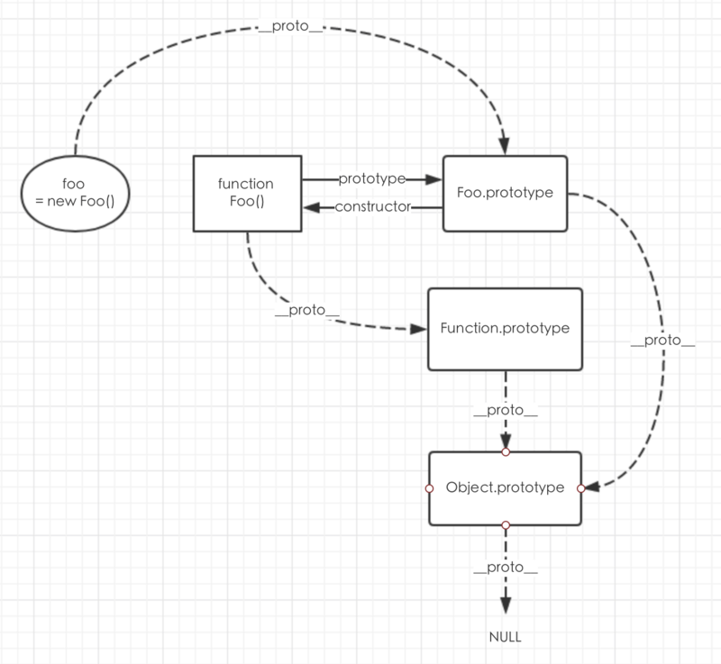

# 原型与原型链
## `for in`能否把原型链循环出来
能。

### 如何避免？
使用 `hasOwnProperty`。

## 原型链


```js
function Father () {
    this.property = true;
}

Father.prototype.getFatherValue = function() {
  return this.property
}

function Son() {
    this.sonProperty = false;
}

// 继承Father
Son.prototype = new Father(); // Son.prototype被重写，导致Son.prototype.constructor也被重写
Son.prototype.getSonValue = function () {
    return this.sonProperty;
}

var instance = new Son();
alert(instance.getFatherValue())
```
instance实例通过原型链找到了Father原型中的getFatherValue方法.

### 如何判断原型和实例的继承关系
```js
instance instanceof Object;

Object.prototype.isPrototypeOf(instance);

Object.getPrototypeOf(obj) 
```

::: warning
问题一: 当原型链中包含引用类型值的原型时,该引用类型值会被所有实例共享;

问题二: 在创建子类型(例如创建Son的实例)时,不能向超类型(例如Father)的构造函数中传递参数.
:::

## 继承
通过【某种方式】让一个对象可以访问到另一个对象中的属性和方法，我们把这种方式称之为继承

### 为什么要使用继承
有些对象会有方法(动作、行为)，而这些方法都是函数，如果把这些方法和函数都放在构造函数中声明就会导致内存的浪费

```js
function Person(){
        this.say=function(){
            console.log("你好")
        }
    }
    var p1=new Person();
    var p2=new Person();
    console.log(p1.say === p2.say);   //false
```

### 原型链继承
```js
function Animal(species){
  this.species = species
}
Animal.prototype.func = function(){
  console.log('Animal')
}
function Cat(){}
/**
 * func方法是无效的, 因为后面原型链被重新指向了Animal实例
 */
Cat.prototype.func = function() {
  console.log('Cat')
}
Cat.prototype = new Animal()
Cat.prototype.constructor = Cat // 修复: 将Cat.prototype.constructor重新指向本身
/**
 * 测试代码
 */
var cat = new Cat()
cat.func() // output: Animal
console.log(cat.species) // undefined
```

### 经典继承【借用构造函数】
使用call或apply方法，将父对象的构造函数绑定在子对象上
```js
function Father(){
	this.colors = ["red","blue","green"];
}
function Son(){
	Father.call(this);//继承了Father,且向父类型传递参数
}
var instance1 = new Son();
instance1.colors.push("black");
console.log(instance1.colors);//"red,blue,green,black"

var instance2 = new Son();
console.log(instance2.colors);//"red,blue,green" 可见引用类型值是独立的
```
::: warning
方法都在构造函数中定义, 因此函数复用也就不可用了.而且超类型(如Father)中定义的方法,对子类型而言也是不可见的. 考虑此,借用构造函数的技术也很少单独使用.
:::
```js
function Animal(name){
  this.name = name;
  this.sayName = function(){
    console.log(this.name)
  }
}
Animal.prototype.setName = function(){
  console.log('123')
}

function Cat(){
  Animal.call(this, 'dog');
}

var cat = new Cat();
```


### 组合继承【伪经典继承】
组合继承, 有时候也叫做伪经典继承,指的是将原型链和借用构造函数的技术组合到一块,从而发挥两者之长的一种继承模式.
```js
function Father(name){
	this.name = name;
	this.colors = ["red","blue","green"];
}
Father.prototype.sayName = function(){
	alert(this.name);
};
function Son(name,age){
	Father.call(this,name);//继承实例属性，第一次调用Father()
	this.age = age;
}
Son.prototype = new Father();//继承父类方法,第二次调用Father()
Son.prototype.sayAge = function(){
	alert(this.age);
}
var instance1 = new Son("louis",5);
instance1.colors.push("black");
console.log(instance1.colors);//"red,blue,green,black"
instance1.sayName();//louis
instance1.sayAge();//5

var instance1 = new Son("zhai",10);
console.log(instance1.colors);//"red,blue,green"
instance1.sayName();//zhai
instance1.sayAge();//10
```

### 原型继承
将子对象的prototype指向父对象的一个实例
```js
 var o1={ say:function(){} }
 var o2=Object.create(o1);
```

### 寄生式继承
寄生式继承是与原型式继承紧密相关的一种思路
```js
function createAnother(original){
	var clone = Object.create(original);//通过调用object函数创建一个新对象
	clone.sayHi = function(){//以某种方式来增强这个对象
		alert("hi");
	};
	return clone;//返回这个对象
}
```
使用寄生式继承来为对象添加函数, 会由于不能做到函数复用而降低效率;这一点与构造函数模式类似.

### 寄生组合式继承
寄生组合式继承就是为了降低调用父类构造函数的开销而出现的
```js
function extend(subClass, superClass) {
  subClass.prototype = superClass.prototype;

  subClass.superclass = superClass.prototype;
  if(superClass.prototype.constructor == Object.prototype.constructor) {
    superClass.prototype.constructor = superClass;
  }
}
```

```js
function Father(name){
	this.name = name;
	this.colors = ["red","blue","green"];
}
Father.prototype.sayName = function(){
	alert(this.name);
};
function Son(name,age){
	Father.call(this,name);//继承实例属性，第一次调用Father()
	this.age = age;
}
extend(Son,Father)//继承父类方法,此处并不会第二次调用Father()
Son.prototype.sayAge = function(){
	alert(this.age);
}
var instance1 = new Son("louis",5);
instance1.colors.push("black");
console.log(instance1.colors);//"red,blue,green,black"
instance1.sayName();//louis
instance1.sayAge();//5

var instance1 = new Son("zhai",10);
console.log(instance1.colors);//"red,blue,green"
instance1.sayName();//zhai
instance1.sayAge();//10
```

```js
/**
 * 寄生组合继承的核心代码
 * @param {Function} sub 子类
 * @param {Function} parent 父类
 */
function inheritPrototype(sub, parent) {
  // 拿到父类的原型
  var prototype = Object(parent.prototype) 
  // 改变constructor指向
  prototype.constructor = sub
  // 父类原型赋给子类
  sub.prototype = prototype
}
function Animal(species){
  this.species = species
}
Animal.prototype.func = function(){
  console.log('Animal')
}
function Cat(){
  Animal.apply(this, arguments) // 只调用了1次构造函数
}
inheritPrototype(Cat, Animal)
/**
 * 测试代码
 */
var cat = new Cat('cat')
cat.func() // output: Animal
console.log(cat.species) // output: cat
```

### new操作符干了什么
```js
var obj  = {};
obj.__proto__ = F.prototype;
F.call(obj);
```

第一行，我们创建了一个空对象obj;
第二行，我们将这个空对象的__proto__成员指向了F函数对象prototype成员对象;
第三行，我们将F函数对象的this指针替换成obj，然后再调用F函数.
我们可以这么理解: 以 new 操作符调用构造函数的时候，函数内部实际上发生以下变化：
1、创建一个空对象，并且 this 变量引用该对象，同时还继承了该函数的原型。
2、属性和方法被加入到 this 引用的对象中。
3、新创建的对象由 this 所引用，并且最后隐式的返回 this.
